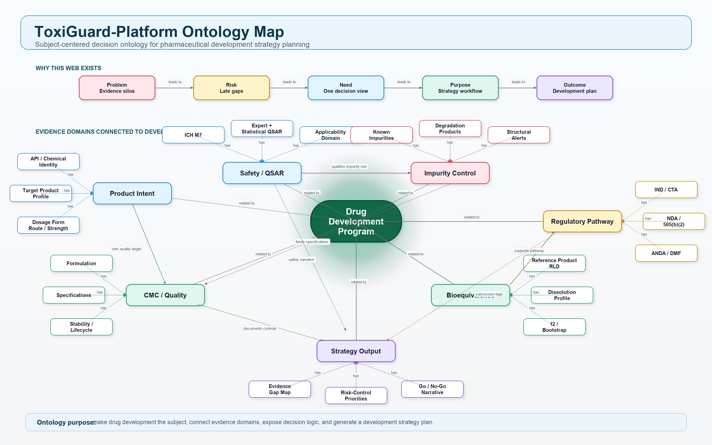

# ToxiGuard-Platform Sharing Guide

Prepared for sharing with **Dr. Kinam Park, Purdue University**  
Prepared by **Young-nam Lee**  
Contact: <lyn0109@gmail.com>  
Project: **ToxiGuard-Platform**  
Version: v1.0 decision-support prototype

---

## 1. Short Message for Email

Dear Dr. Park,

I hope you are doing well. I am sharing a prototype platform I have been developing, **ToxiGuard-Platform**, which is designed to support early pharmaceutical development strategy by connecting chemical identity, ICH M7/QSAR genotoxicity assessment, impurity/degradation evidence, CMC risk logic, FDA-oriented reference product lookup, and bioequivalence/dissolution planning into one decision workflow.

The main purpose is not to replace expert review, but to create an integrated decision-support environment for identifying evidence gaps, prioritizing development risks, and preparing a more structured regulatory development plan before formal submission activities.

I would be grateful for your feedback on the scientific logic, user workflow, and potential academic or industry-facing value of this platform.

Best regards,  
Young-nam Lee

Suggested app link: `[insert Streamlit app URL]`  
Suggested repository link: `[insert GitHub repository URL]`

---

## 2. Executive Summary

**ToxiGuard-Platform** is a Streamlit-based regulatory development strategy platform for pharmaceutical product development. It connects multiple decision domains that are often reviewed separately:

- API or impurity chemical identity
- ICH M7-aligned QSAR and genotoxicity screening
- Structural alert and toxicophore visualization
- Impurity and degradation product evidence mapping
- FDA/compendial source mapping
- Reference product and dosage strength lookup
- Bioequivalence and dissolution-profile planning
- f2 similarity factor with bootstrap-based uncertainty assessment
- Project-level development strategy and evidence-gap planning

The platform is intended as a **decision-support and strategy-planning tool**, not as an official regulatory conclusion engine.

---

## 3. Why This Platform Was Developed

Pharmaceutical development teams often make early go/no-go and control-strategy decisions using evidence that is scattered across chemistry, toxicology, CMC, regulatory affairs, pharmacopeial references, and bioequivalence planning documents.

ToxiGuard-Platform was developed to address this practical gap:

| Problem | Development Consequence | Platform Response |
|---|---|---|
| Toxicology, CMC, impurity, dissolution, and regulatory evidence are fragmented | Late gap detection and slow go/no-go decisions | One project-level development map |
| ICH M7/QSAR outputs are difficult to connect with impurity controls | Weak impurity justification and unclear control strategy | QSAR, structural alerts, and degradation evidence are linked |
| FDA reference product and dissolution information are often checked separately | BE planning may start without clear reference-product context | Reference lookup and dissolution planning are connected |
| f2 similarity is often treated as a single-point calculation | Uncertainty and profile variability may be under-communicated | Bootstrap-based f2 distribution and confidence interval |
| Regulatory strategy documents require narrative logic | Evidence may exist but not be submission-ready | The app produces a decision narrative and evidence-gap map |

---

## 4. First Screen: Ontology-Based Development Logic

The landing page introduces the platform as a **drug development ontology map**. The subject is the development program, not merely a chemical structure or a QSAR model.

The map shows how the platform organizes a development strategy around:

- Product intent
- Nonclinical safety and ICH M7/QSAR
- Impurity and degradation control
- CMC/quality strategy
- Bioequivalence and dissolution
- Regulatory pathway
- Strategy outputs such as evidence-gap map, risk-control priorities, go/no-go narrative, and submission narrative

---

## 5. Main Workflow

The user starts with a single **Chemical / API Name**. This primary input is used to connect multiple downstream modules.

> Screenshot to insert after final capture: **Primary Chemical / API Name input screen**  
> Capture after opening the deployed ToxiGuard-Platform landing page and entering the app.

Recommended workflow:

1. Enter the API, impurity, or degradant name.
2. Resolve chemical identity and SMILES.
3. Run ICH M7/QSAR and structural-alert screening.
4. Review impurity and degradation evidence.
5. Search FDA reference product and dissolution method information.
6. Enter laboratory reference/test dissolution profiles.
7. Calculate f2 and bootstrap uncertainty.
8. Review the integrated development strategy snapshot.

---

## 6. Strategy Dashboard

The dashboard translates module outputs into development strategy status.

> Screenshot to insert after final capture: **Strategy Dashboard**  
> Recommended capture state: API name entered, integrated assessment status visible, and module detail tabs shown.

Key outputs:

- Development stage
- Submission pathway
- Dosage form
- Role view, such as CMC/Analytical or Regulatory Affairs
- Overall regulatory risk
- QSAR/genotoxicity status
- Impurity/degradation status
- Bioequivalence status
- Recommended next action

This screen is intended to help a development team quickly understand where evidence is strong, where evidence is missing, and which module should be reviewed next.

---

## 7. Genotoxicity QSAR and ICH M7 Module

The QSAR module is designed around the logic of ICH M7 impurity evaluation. It does not claim to replace commercial validated QSAR systems, but it creates a structured evidence object that can support expert review.

> Screenshot to insert after final capture: **Genotoxicity QSAR detail screen**  
> Recommended capture state: compound identity, ICH M7 class, evidence matrix, and structural explanation visible.

The module includes:

- Chemical identity and SMILES resolution
- ICH M7 class assignment logic
- Expert rule-based structural alert screen
- Statistical fragment screen, where available
- Evidence matrix
- Applicability-domain statement
- Structural explanation
- Regulatory draft language

Example interpretation categories:

- **Class 1**: Known mutagenic carcinogen
- **Class 2**: Known mutagen with unknown carcinogenic potential
- **Class 3**: Alerting structure, unrelated to drug substance
- **Class 4**: Alerting structure also present in drug substance
- **Class 5**: No alert identified

Final ICH M7 classification requires expert review and, where relevant, validated dual QSAR systems and experimental evidence.

---

## 8. Structure and Toxicophore Visualization

The structure screen is used to help distinguish between ordinary chemical/physicochemical features and genotoxicity-relevant structural alerts.

> Screenshot to insert after final capture: **Structure / Toxicophore visualization**  
> Recommended capture state: 2D structure visible, alert atoms highlighted where applicable, and interpretation text shown.

The visualization is intended to answer:

- Which structural feature is driving the genotoxicity concern?
- Is the alert present in the drug substance or only in an impurity/degradant?
- Is the feature part of a known reactive alert class?
- Is the structure being interpreted as a chemical identity feature only, or as a toxicologically relevant alert?

This is useful for expert discussion because it makes the logic visible rather than treating QSAR as a black box.

---

## 9. Impurity and Degradation Evidence

The platform includes an impurity/degradation section that is designed to connect:

- Known related substances
- Known or predicted degradation products
- Structural alerts
- ICH M7 class logic
- Pharmacopeial or regulatory evidence source mapping
- Product-specific CMC context

> Screenshot to insert after final capture: **Integrated Evidence or degradation profile screen**  
> Recommended capture state: impurity/degradation evidence table and source map visible.

The current prototype supports structured evidence mapping and local known-impurity profiles. Future development should expand this into a curated database layer, with documented provenance for each impurity or degradant.

Recommended evidence hierarchy:

1. Official product-specific FDA guidance or regulatory review documents
2. USP/EP monograph and pharmacopeial impurity references
3. DMF or CMC-related public information where available
4. Peer-reviewed stability/degradation literature
5. Public chemical databases
6. In silico predicted degradation products

---

## 10. Bioequivalence and Dissolution Strategy

The bioequivalence module supports FDA-oriented comparative dissolution planning.

> Screenshot to insert after final capture: **Bioequivalence module**  
> Recommended capture state: reference/test dissolution profile table, f2 result, bootstrap CI, and FDA interpretation visible.

The module is designed to:

- Search reference product or active ingredient information
- Display product name, applicant/company, dosage form, route, application type, RLD/RS status, and dosage strength where available
- Distinguish dosage-form strategy, including immediate-release and modified-release logic
- Build a reference/test dissolution profile input table
- Calculate f2 similarity factor
- Apply bootstrap resampling to estimate uncertainty
- Provide a strategy interpretation for FDA-style dissolution similarity rationale

Important clarification:

- **Dosage strength** refers to the labeled amount of active ingredient in the product, such as 500 mg tablet or 10 mg capsule.
- **Dose** in a bioequivalence study refers to the administered study dose, which may involve one or more dosage units depending on protocol design.

---

## 11. FDA Reference Product and Dissolution Lookup

The app can assist with reference product and dissolution method lookup. However, public direct access to some FDA sources can be rate-limited, blocked, or unavailable in cloud deployment environments. The platform therefore treats these results as source-assistive, not source-complete.

> Screenshot to insert after final capture: **FDA reference product and dissolution lookup**  
> Recommended capture state: trade/product name, applicant/company, dosage strength, dosage form/route, RLD/RS, and source status visible.

Recommended interpretation:

- Orange Book information should be verified through the official FDA Orange Book search page.
- Product-specific dissolution method conditions should be verified using the FDA Dissolution Methods Database and product-specific guidance where available.
- Actual reference/test dissolution percentages are usually generated by laboratory testing and are not generally available as structured FDA data.

---

## 12. Consulting and Collaboration Request

The platform includes a consulting/contact section for follow-up discussions.

> Screenshot to insert after final capture: **Consulting and collaboration request screen**  
> Recommended capture state: contact form and email link visible.

Suggested discussion topics with Dr. Park:

- Scientific usefulness of ontology-based development planning
- How to strengthen the formulation and drug-delivery strategy layer
- Whether dissolution and modified-release strategy should be expanded
- How to frame this as a regulatory science decision-support tool
- Potential research collaboration around AI/NAMs, formulation strategy, and evidence integration
- How to evaluate model credibility and human expert oversight

---

## 13. Regulatory and Scientific Basis

The current platform logic is aligned conceptually with the following regulatory areas:

- ICH M7 for DNA-reactive mutagenic impurities
- FDA and ICH bioequivalence and dissolution profile comparison principles
- FDA Orange Book reference product concepts
- FDA Dissolution Methods Database as product-specific method support
- CMC control strategy and impurity/degradation rationale
- Expert review and evidence-weighting principles

The platform should not be described as FDA-approved, FDA-validated, or equivalent to a commercial validated QSAR platform.

Recommended wording:

> ToxiGuard-Platform is a regulatory decision-support prototype that organizes chemical identity, QSAR/genotoxicity, impurity/degradation, CMC, and bioequivalence evidence into a structured development strategy workflow. It is intended to support expert review and evidence-gap planning, not to replace validated regulatory tools or final scientific judgment.

---

## 14. Current Limitations

The following limitations should be clearly disclosed when sharing the app:

- The platform is a prototype and decision-support tool.
- It is not endorsed, approved, certified, or validated by FDA, ICH, USP, EP, Purdue University, or any other institution.
- QSAR results are preliminary and require expert interpretation.
- For regulatory submission, validated dual QSAR systems and documented expert review may be required.
- FDA and public database lookups may be incomplete or blocked depending on deployment environment.
- USP/EP data may require licensed access and should not be copied into the app unless permission allows.
- Bioequivalence calculations require actual laboratory reference/test dissolution data.
- f2 bootstrap output supports uncertainty communication but does not replace product-specific BE study design.

---

## 15. Recommended Demo Script

Suggested 5-minute demo:

1. Open the landing ontology map and explain the platform purpose.
2. Enter an API name, such as `acetaminophen`, `metformin`, or `telmisartan`.
3. Show SMILES resolution and automatic integrated run status.
4. Open **Genotoxicity QSAR** and explain ICH M7 class logic.
5. Show structure/toxicophore mapping and evidence matrix.
6. Open **Bioequivalence** and explain reference product, dosage strength, dissolution profile, f2, and bootstrap logic.
7. Return to the strategy dashboard and explain how the output becomes a development strategy plan.

Suggested closing question:

> From a formulation and pharmaceutical development perspective, what evidence domains or decision nodes should be added to make this platform more useful for early development planning?

---

## 16. Korean Summary for Personal Explanation

박사님께 설명드릴 때의 핵심 메시지는 다음과 같습니다.

> 이 플랫폼은 단순한 독성 예측 앱이 아니라, 의약품 개발 초기에 필요한 허가개발 전략을 세우기 위한 decision-support platform입니다. 하나의 chemical/API name에서 시작해서 QSAR/ICH M7, impurity/degradation, CMC control strategy, FDA reference product, dissolution/bioequivalence까지 연결하고, evidence gap과 다음 개발 우선순위를 보여주는 것이 목적입니다.

---

## 17. Screenshot Capture Checklist

The prior draft screenshots were removed because they were not from the correct
ToxiGuard-Platform app page. Before sharing this document externally, capture
fresh screenshots from the current deployed app and save them using the names
below:

- `docs/images/01_landing_ontology.png`
- `docs/images/02_primary_input.png`
- `docs/images/03_strategy_dashboard.png`
- `docs/images/04_genotoxicity_qsar.png`
- `docs/images/05_structural_alerts.png`
- `docs/images/06_integrated_evidence.png`
- `docs/images/07_bioequivalence.png`
- `docs/images/08_fda_reference_lookup.png`
- `docs/images/09_consulting_contact.png`

Recommended screenshot order:

1. Landing page with ontology map and Enter button
2. Primary Chemical / API Name input
3. Strategy Dashboard after an integrated run
4. Genotoxicity QSAR detail screen
5. Structure/toxicophore visualization
6. Impurity/degradation or integrated evidence section
7. Bioequivalence f2/bootstrap module
8. FDA reference product and dissolution lookup
9. Consulting/contact request section

Legal and attribution files:

- `LICENSE`
- `NOTICE.md`
- `DISCLAIMER.md`
- `ASSET_ATTRIBUTION.md`
